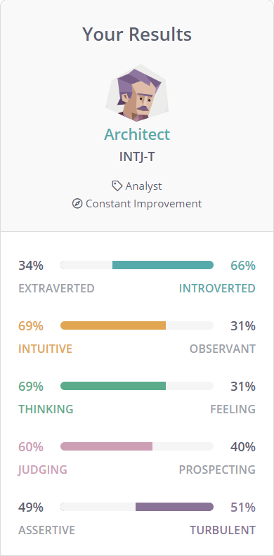
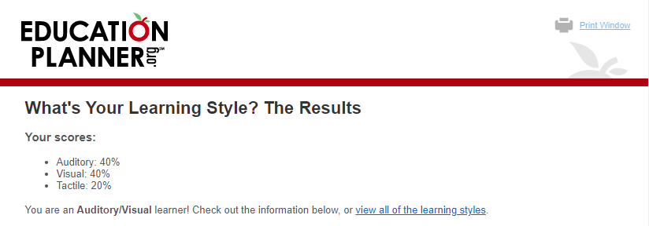
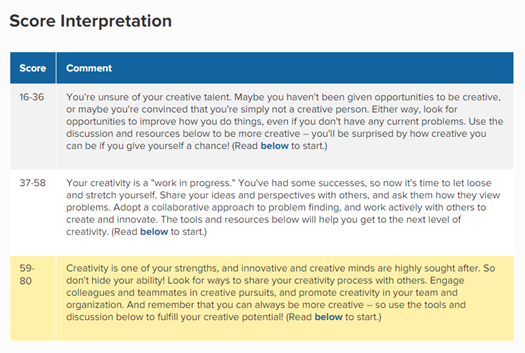

# project-quartet
S3547090 - Assignment 01
<!DOCTYPE html>
<html>
<body>

<h1>ASSIGNMENT ONE</h1>

<h3>PERSONAL INFORMATION</h3>

Name: Kien Luong

Preferred Name: Patrick Luong

Student ID: s3547090

Student email: s3547090@student.rmit.edu.au

<h4>About me:</h4>

Born in Australia with a Chinese-Vietnamese background, youngest of two. 
As far as cultural identity, my parents would call me Australian but most Australians would call me Asian, just to paint a picture of the identity struggle many Australian-born minorities such as myself face. For hobbies I enjoy playing video games, going to the gym, playing guitar, reading and creative writing.

Fun Fact: Have previously competed at a national level at swimming, tennis and most recently video games.

<h3>INTEREST IN IT</h3>

My initial interest in IT was spawned for my father’s professional in wholesale electronics warehousing. I would often have to spend a couple hours after primary school there, waiting for his shift to finish where I would watch professionals assemble and prepare computers to fulfil orders, completely unaware of the lasting impact it would impart on me. From then on, I was always interested in computing hardware and begged my dad to buy me a computer at a young age.

It was at secondary and tertiary education levels where I worked more with the software side of IT, learning my way through generic IT solutions like Microsoft office and finally in my work-life where I found how integral computer literacy can be to the efficiency and effectiveness of proper workflow.

As technology crept forward throughout the 2010’s, the landscape of the workforce began to change from traditional work spaces to a more remote based, decentralised work force, reaching a global apex during the Covid-19 pandemic. As a team leader at my work, I can extrapolate how this will forever change how business’ work in a modern, technologically advanced era.

In pursuit of more complete IT proficiency, I started studying part time while balancing full time work in the hopes to expand my skillset and widen my career options as I am not completely set in terms of the path I want to pursue. Throughout my studies I expect to broaden not only my knowledge but improve areas such as teamwork, problem solving and project execution.

<h3>IDEAL JOB</h3>

This role involves analysing data at a large scale in order to determine underlying trends which can provide insights to the client on various business improvements. Furthermore, it will require development and management of datasets and troubleshooting a wide array of data issues.

This position requires an analytical mind for problem solving and trend identification throughout. Furthermore, strong mathematical and numeracy skills with professional communication and collaborative presentation ability. On a technical level, the job requires proficiency in databases such as SQL Server, Oracle and/or SAP as well as in depth experience with digital marketing analytics tools.

The skillsets I believe I already possess are an innate mind for analysis, shown in the personal profile below, and mathematic skills as well as experience in data reporting and collaborative.

In order to attain the necessary skills for this role I plan on completing my planned qualification within the next five years while simultaneously working full-time to provide real world business experience. Further to this, an important element that cannot be ignored when climbing the employment ladder is the ability to network and work cohesively with others.

<h3>PERSONAL PROFILE - TEST RESULTS</h3>
<h5>MYERS-BRIGGS PERSONALITY TEST</h5>

<h5>ONLINE LEARNING STYLE TEST</h5>

<h5>ONLINE CREATIVITY TEST</h5>

<h3>PERSONAL PROFILE ANALYSIS</h3>

The results of these tests affirm to me that I instinctively use my analytical, logical side of my personality for decision making and organisation while remaining relatively creative in the correct environment. It also shows a weakness in my social ability and highlights the need for me to strengthen this aspect of myself. 

In a team environment, I may tend to be less assertive and instead opt for a more collaborative effort with my team members. Further, the learning style test shows I particularly process information better when listening, rather than wrote or visual. I should stay mindful to still have confidence in my contribution and understand it makes up only a part of the whole picture. When forming a team, I should aim to form a well balanced with some members taking more vocal leadership while I can analyse and provide a more intuitive role.

<h2>PROJECT IDEA - PROJECT QUARTET</h2>
<h3>OVERVIEW</h3>

My idea for a project is a service which finds and matches users for various hobby enthusiasts. In an ever increasing digitally connected world, studies show we are missing out on traditional social interactions, exacerbated by the recent, ongoing Covid-19 global pandemic, which has caused most social lives to halt to a standstill. Furthermore, figures show depression has increased by a factor of over three times shown in Ettman’s (2020) US study measuring depression symptoms pre-pandemic against today’s statistics.  Project Quartet would build a larger social network which facilitates its users based on interest, location & experience level to create a balanced network of users, each operating as a mini-social network of its own. Other popular platforms like Facebook have similar models but lack the pseudo-matchmaking system offered with Project Quartet, which will require other improvements over its predecessors in order to become viable both practically and financially.

<h3>MOTIVATION</h3>

A 2019 study on in-person social interaction drop-offs comparative of pre and post turn of the 21st century by Twenge  in U.S. adolescence shows a steep decline in face-to-face interactions regarding teenagers, specifically with college bound seniors spending on average less than an hour a day engaging in non-study in-person social interactions. Furthermore, adolescents with low in-person social interactions and high social media usage have reported the most symptoms and feelings of loneliness. This obvious trend towards digital, decentralised interaction feels irreversible with cutting edge technology creating a widening gap between peer to peer via Facetime, Zoom, Skype etc. and cutting down on the need for in-person interactions. 

A consequence of this movement is the drop off in secondary connections made, wherein two peers find common interests and activities between one another without necessarily seeking those out. Project Quartet aims to be a mesh network, working behind the scenes to create these sparks of interaction for its users based solely strictly on information voluntarily provided by its user-base.

<h3>DESCRIPTION</h3>

Project Quartet works as its own social network, where users can input the general location, they are willing to travel across (if necessary) and provide key hobbies they are interested in interacting with other users about. Take for example, I am a new user based in South-East Melbourne looking for others to play regular casual basketball with. Given my preferences of regular scheduling, casual level, age group and personal experience within the sport, Project Quartet would find other users within my set location radius to match me with. Another example would be a self-taught guitarist with a couple of months of experience can find like-minded musicians in their area to form jam sessions on an on-demand basis which can potentially cultivate increased levels of growth both in experience and musical knowledge. The applications for this matchmaking system can be warped and transformed to fit any number of popular hobbies from traditional sports and music to newer frontiers such as competitive gamers, looking for other local players to play with regularly.

To dissuade users from unwanted behaviour regarded as inflammatory, insincere such as bullying or purposeful misuse of the system itself, a user rating system based on peer-to-peer review can be used, such as those found in Uber or Menulog services. This allows users to rate their interactions with one another and call out unwanted behaviours with a hidden user score. We can then use this user score to warn users who have been rated poorly or even restrict the matchmaking capabilities of those who persistently create negative interactions with their peers. 

Alternatively, a low fee annual payment plan could be implemented to ensure all users have inbuilt investment and stakes in both their profile and the interactions they take part of throughout. Although a pitfall of this would be that users could take the groups they form on the platform, and eventually migrate, no longer needing the service to continue their activities together. This part of the platform will need further review if moving forward.

<h3>TOOLS & TECHNOLOGIES</h3>

The technology required to execute this project have already been pioneered with ride share services and common social media platform practices. Users may need to download apps or access webpages in order to use this service, but rudimentary messaging services and bulletin posting should suffice.

<h3>SKILLS REQUIRED</h3>

This project will require app coding and web-page construction for its backend. 
Furthermore, a service like this completely depends on its user base becoming large enough to sustain itself and bring in new users. This will require marketing and intuitive design work in order to make the app/service user friendly and simple as possible, this allows even non-tech savvy users to take advantage of the service.

<h3>OUTCOME</h3>

This project has the potential to take back an element of human interaction that has taken a hit since the start of the social media era. The project aims to curb ongoing trends of younger generations feeling lonelier than their predecessors, and an underlying underdevelopment of social skills in order to combat common symptoms of depression and social anxiety. 
Although not perfect, it is important to adapt to the shifting landscape of interpersonal relationships rather than correct it. This project aims to provide its users with the tools to build meaningful connections on a local level, to enrich and improve the mentality of an progressively isolated society.

</body>
</html>
